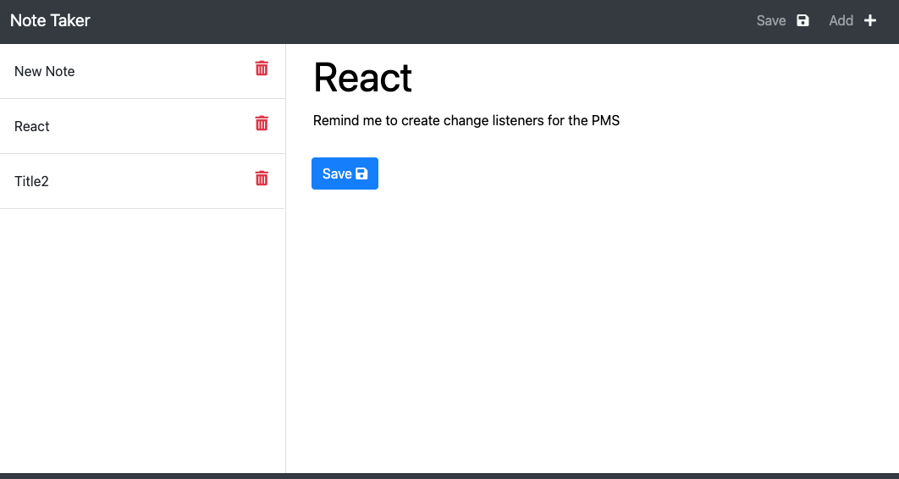

# Express.js Note Taker      

# Table of Contents
- [Project Description](#project-description)
- [Installation Instructions](#installation-instructions)
- [Usage](#usage)
- [Screenshot](#screenshot)
- [Walkthrough Videos](#walkthrough-video)
- [How To Contribute](#how-to-contribute)
- [Testing Instructions](#testing-instructions)
- [Technology](#technology)
- [Questions](#questions)
- [License](#license)

# Project Description
This small [web application](https://express-note-taker-jps.herokuapp.com/) allows the user to create/update/delete and view simple notes (title and content) that are stored persistently on a webserver.

# Installation Instructions

1.  Install [node.js](http://nodejs.org)
2.  Using the installed Node Package Manager `npm`, execute `npm install` to install the required libraries.

# Usage

1. To execute the application, use a command line interface (CLI) such as terminal (or in windows command) and execute `npm run start` or alternatively `node backend/dist/server.js`
2. Open a web browser and navigate to the homepage of the web application ([default is](http://localhost:3000))

# Screenshot

## How to contribute

Please access the [Questions](#questions) section to send me an email, or access the repository link if you wish to help contribute to this project.

# Testing Instructions

Use a command line interface (CLI) such as terminal (or in windows command) and execute `npm run test` to run the unit tests for the project.

# Technology

1. [Node.js](http://nodejs.org)
2. NPM
4. [Moment](https://npmjs.com/package/moment)
5. [Markdown License badges](https://gist.github.com/lukas-h/2a5d00690736b4c3a7ba)
6. [Jest](https://jestjs.io/)
7. [Bootstrap](https://getbootstrap.com/)
8. [Typescript](https://www.typescriptlang.org/)
9. [Babel](https://babeljs.io/)

# Questions

>  **Direct your questions about this project to:**
>
>  *GitHub:* [Github Project Link](https://github.com/jsharples777/week-12-homework)
>
>  *Email:* [jamie.sharples@gmail.com](mailto:jamie.sharples@gmail.com)

# License

### [MIT License](https://opensource.org/licenses/MIT)
A short and simple permissive license with conditions only requiring preservation of copyright and license notices. Licensed works, modifications, and larger works may be distributed under different terms and without source code.